# SubMarine
This Project aims to utilize low cost Microcontrollers to receive and transmit Signals in the Sub-Ghz Frequency range. The ESP32 can be controlled using an Android App that is connected via Bluetooth. Another Goal i wanted to achieve is the possibility to do "Wardriving" for Sub-Ghz Signals. I accomplished this by using the GPS Location of my Android Device paired with a recorded Signal from the ESP32 and storing Signaldata, Date, Time and the Location where it was received in a local Database.

> **_NOTE:_**  This Project is in a very early State.  Contribution by anyone is Welcome.

## Flipper Zero .sub File Support

Since the Flipper Zero also utilizes a CC1101 Transceiver for Sub-Ghz Operations i wanted to make use of the large amount of recorded .sub Files that are provided by the Community.
With this Setup it is possible to transmit .sub Files that were recorded using a Flipper Zero Device. You can download those Files to your Phone and Import them within the SubMarine Android App.
Once you did that, you are able to transmit the Signal or even store it in your local Database for later use.
Currently the Implementation requires the following the Properties in the .sub File:

| Property | Value |
| ------ | ------ |
| Filetype | Flipper SubGhz RAW File |
| Preset | FuriHalSubGhzPresetOok650Async or FuriHalSubGhzPresetOok270Async |
| Protocol | RAW |

More supported Properties will be implemented in the Future, however those Properties are set in most of the public available .sub Files already.

## Functions

### Recording Signals
The Device can record raw Signals and save them in a local Database.

### Replaying Signals
Recorded Signals can be replayed immediately after recording or anytime after they were stored in the Database.

### Detect Signals
The Device can scan a list of Frquencys in a row quickly and indicate if a transmission is received on one of those.

### Change CC1101 Configuration
Frequency, Modulation, DRate, RxBandwith and PktFormat of the CC1101 can be changed while the Device is connected.

### Periscope Mode (Wardriving)
When the Periscope Mode is activated the Device records any received Signal and sends it to the connected Android Device. On the Android Device the Signaldata is extended with the current GPS Location, Date and Time and then stored in the local Database so it can be replayed later.

### Signal Database
You can browse, search and edit your recorded Signals anytime without being connected to the ESP32.

### Signal Generator
The Signalgenerator lets you play around with recorded Signals. You can set a Symbolrate and view Binary and Hex Data of recorded Signals. Also Signals can be modified here and retransmitted.

### Signal Map
The Signal Map shows all Signals from the local Database that have a associated Location. You can browse, for example after Wardriving with Periscope mode, and view/transmit signals again.

 

## Hardware

For this Project i used a ESP32 D1 Mini NodeMCU connected to a TI-CC1101 Transceiver (10 PIN Version). Optionally this Setup can be powered with a 18650 Battery Cell connected via a TP4056 Charging Module and a Switch to toggle the Device on/off.

| Advanced | Basic |
| ------ | ------ |
| 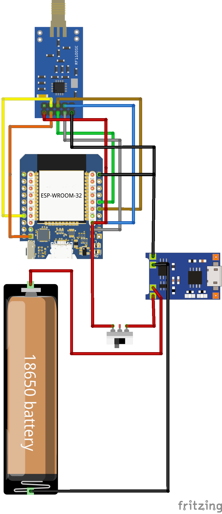 |  |

| CC1101 Pin | ESP32 Pin |
|------------|-----------|
| Gnd        | Gnd       |
| Vcc        | 3.3v      |
| Gdo0       | gpio2     |
| Csn        | gpio5     |
| Sck        | gpio18    |
| Mosi       | gpio23    |
| Miso       | gpio19    |
| Gdo2       | gpio4     |

ebyte E07 (M1101D) CC1101 8 pin pinout 

| Pin | Function |
|-----|----------|
| 1   | GND      |
| 2   | VCC      |
| 3   | GDO0     |
| 4   | CSN      |
| 5   | SCK      |
| 6   | MOSI     |
| 7   | MISO/GDO1|
| 8   | GDO2     |

##software

Uncomment line 163 if u like
Line 113 serial. Begin from(1000000 to 115200)
Line 76 #define PIN_GDO0 from12 to 2 haven't tried 12 but 2 to be safe
Give all permissions manually to the phone app from apps settings
Open app and press bt button and choose sub marine

## Android App

1-download the the apk from the respitory and unzip it on your phone
2-open the app and go to your phone apps settings (apps>manage apps>submarine>premissions) and grant it all premissions
3-open the app then press on bluetooth logo The Android app will let you Search for Bluetooth Devices nearby so choose device name (submarine) By default the advertised Bluetooth Devicename is: SubMarine.
4-After you click on the Item in the List of found Devices within the App it will connect to the ESP32.
5- Once connected you can start using the Tool.

## Screenshots

|  |  |
| ------ | ------ |
| 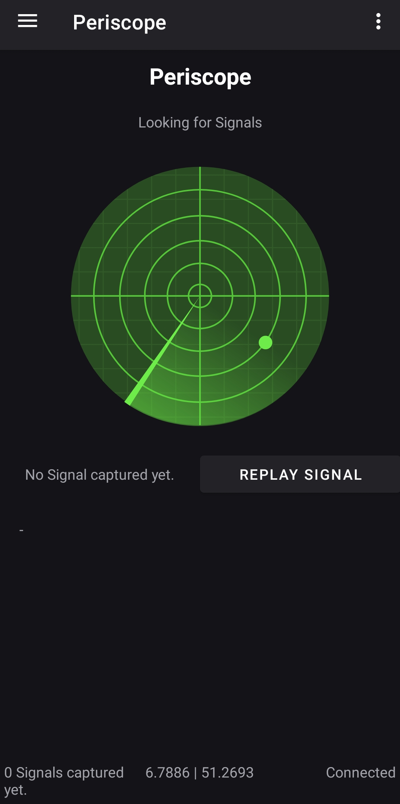 | 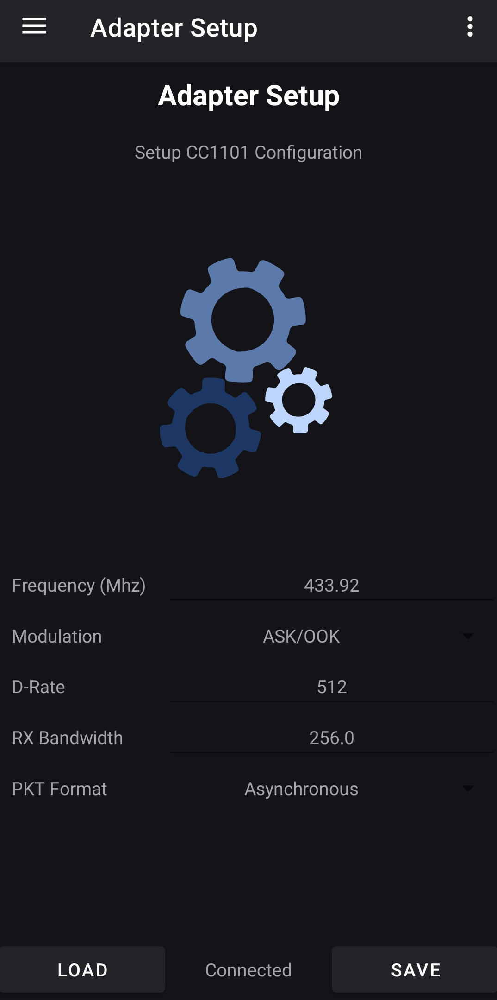 |
|  | 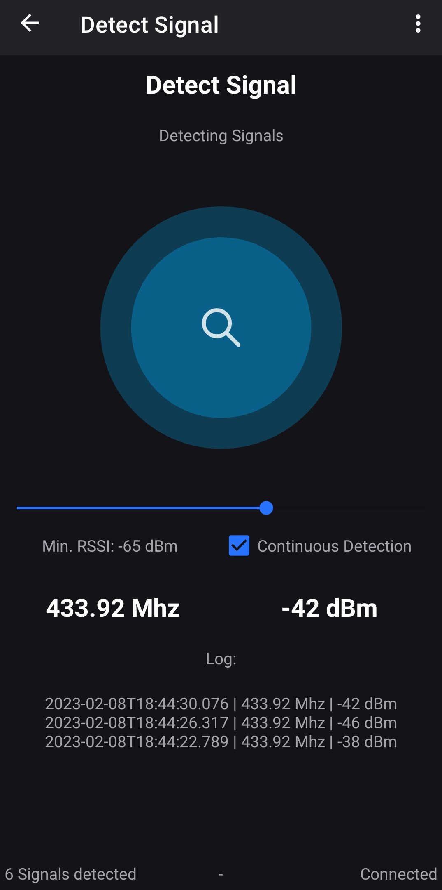 |
| 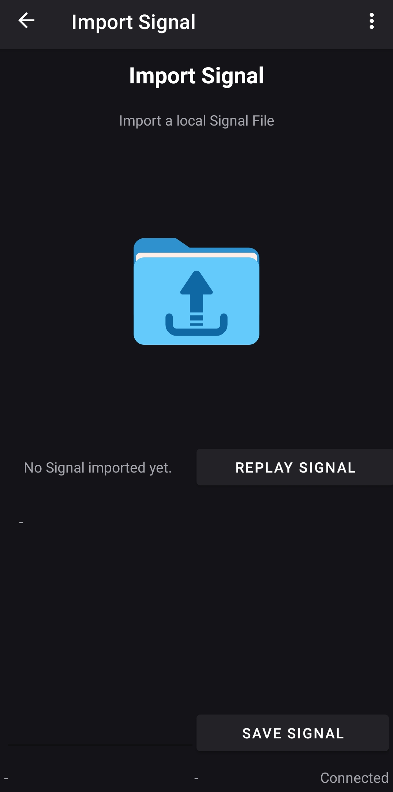 | 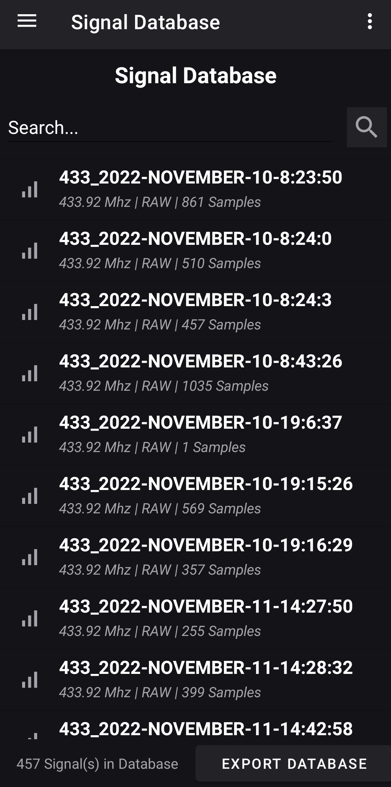 |
|  |  |
| 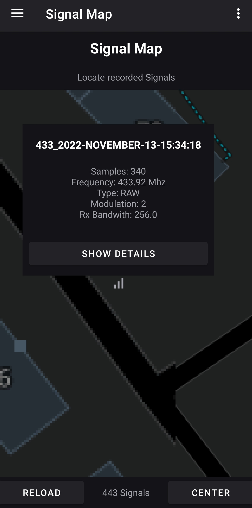 | 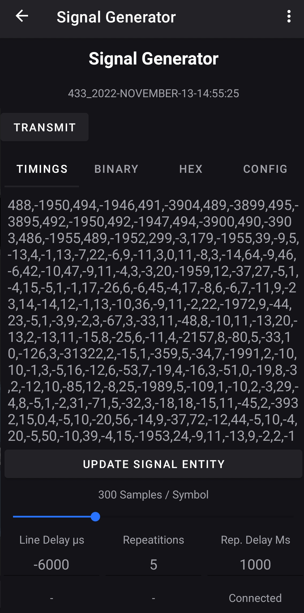 |
| 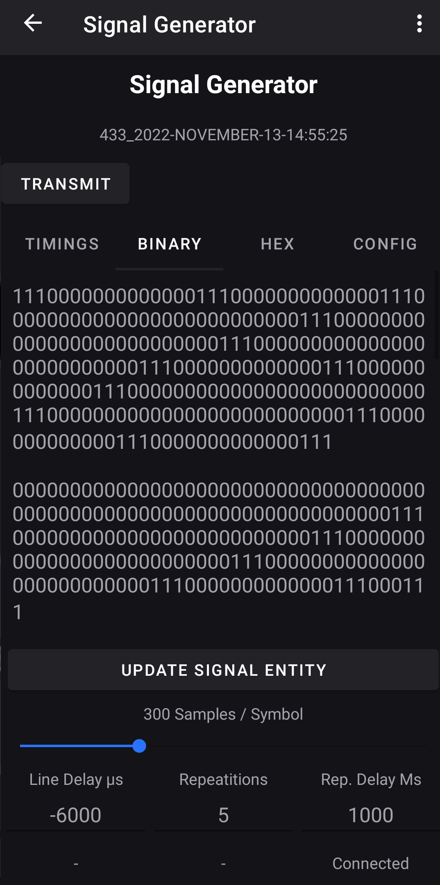 | 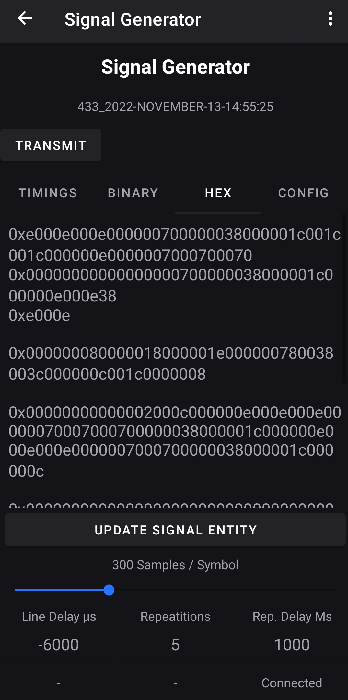 |
| 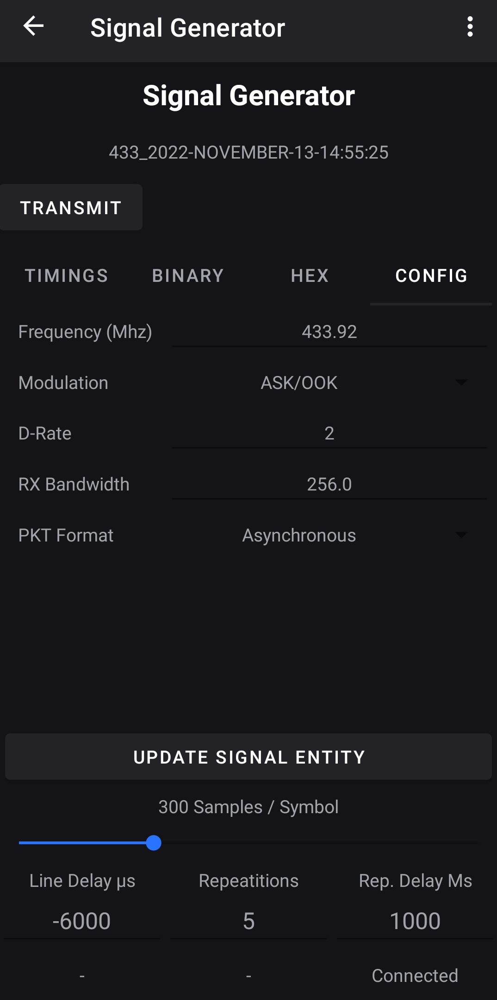 | |

